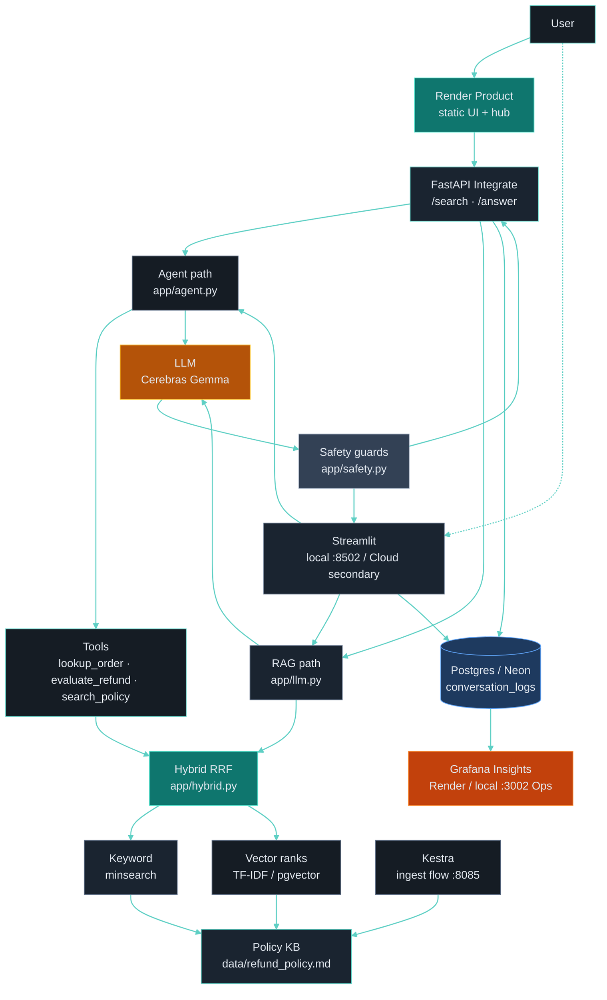

# Policy & Refund Support Agent


**Grounded policy RAG for e-commerce refund support** — retrieve policy clauses, answer with citations, refuse safely when context is missing, and measure quality with an offline eval harness.

Built as a capstone project for [LLM Zoomcamp](https://github.com/DataTalksClub/llm-zoomcamp).

**Official Product (Render):** https://policy-refund-agent.onrender.com  
**Integrate API:** https://policy-refund-agent-api.onrender.com/docs · also `/docs` on Product  
**Insights (Grafana):** https://policy-refund-agent-grafana.onrender.com  
**Secondary prototype (Streamlit Cloud — may sleep):** https://policy-refund-agent.streamlit.app/  
Try chips: ZK-1001 · Non-refundable · 한국어 · or ask freely (Agent tools on).

Hub on Product: **Product · Insights · Integrate · GitHub** · Ops locked (local only).

---

## Problem

This project answers questions and evaluates refund eligibility **from the Zakard Shop refund policy document** (`data/refund_policy.md`), not from general LLM knowledge.

Support teams need answers **strictly from policy documents** and consistent refund decisions. This app:

1. Retrieves policy clauses via hybrid search (keyword + vector RRF) with citations
2. Supports multilingual questions (translate-to-English for search, answer in the user's language)
3. Returns safe fallbacks when context is insufficient or prompt injection is detected
4. Evaluates refund eligibility with mock order tools (`lookup_order` / `evaluate_refund`)
5. Measures quality offline (Hit Rate, MRR, LLM-as-judge), including multilingual questions (Korean / Spanish / French) with English glosses in [`data/eval_data.json`](data/eval_data.json)

### Knowledge base

| Item | Detail |
|------|--------|
| Source | Synthetic **Zakard Shop** refund & return policy |
| File | [`data/refund_policy.md`](data/refund_policy.md) |
| License | Original text written for this project (demo use); not scraped from a live retailer |

---

## Status

**Capstone-ready** — RAG + hybrid RRF + agent tools + safety + Kestra + Grafana.  
**Public deploy:** **Render = official** Product / Insights / Integrate ([`docs/RENDER.md`](docs/RENDER.md), [`render.yaml`](render.yaml)). **Streamlit Community Cloud = secondary** prototype (may sleep) — [Cloud deployment](#cloud-deployment). See [Evaluation criteria](#evaluation-criteria).

### Paths (read this first)

Commands below assume you are in the **repository root** after cloning.

| | |
|--|--|
| **Your machine** | Whatever path you cloned into, e.g. `~/policy-refund-agent` or `C:\dev\policy-refund-agent` |
| **Example used in this README** | `E:\IT_SPACES\AI\Projects\llm\policy-refund-agent` (author’s Windows layout — **not required**) |

Replace the example `cd …` with your own clone path. Relative paths like `data/`, `app/`, and `docker compose` are the same everywhere.

---

## Configuration

| Role | Provider | Variables |
|------|----------|-----------|
| App LLM | **Gemma on Cerebras** (OpenAI-compatible) | `PRA_LLM_BACKEND=cerebras`, `CEREBRAS_*` in `.env` |
| Ops hub gate | Local guidance only (password-locked) | `PRA_OPS_PASSWORD` in `.env` / Render Dashboard — **not** published in README |

```powershell
# Example path (replace with your clone root):
cd E:\IT_SPACES\AI\Projects\llm\policy-refund-agent
. .\scripts\use_e_drive.ps1   # optional: author Windows cache layout on E:
copy .env.example .env        # set CEREBRAS_API_KEY inside
uv sync
uv run pra-check-llm
```

---

## Prerequisites

- Python 3.12+, [uv](https://docs.astral.sh/uv/)
- [Docker Desktop](https://www.docker.com/)
- LLM API key (Cerebras / OpenAI-compatible)

---

## Quick start

**Recommended:** Postgres + Grafana + Streamlit via Compose.

```powershell
# Example path (replace with your clone root):
cd E:\IT_SPACES\AI\Projects\llm\policy-refund-agent
. .\scripts\use_e_drive.ps1   # optional
copy .env.example .env   # if missing — set CEREBRAS_API_KEY
docker compose up -d postgres grafana streamlit
docker compose ps
# Streamlit http://localhost:8502 · Grafana http://localhost:3002 (admin/admin)
# Postgres host :5435 (from Streamlit container use host name `postgres`)
```

Optional orchestration UI: `docker compose up -d kestra-postgres kestra` → http://localhost:8085 (`admin@kestra.io` / `Admin1234!`).

| Service | Port | Notes |
|---------|------|--------|
| `pra-postgres` | **5435** | App metrics DB (`conversation_logs`) |
| `pra-grafana` | **3002** | Monitoring dashboard |
| `pra-streamlit` | **8502** | Chat UI (`Dockerfile`) |
| `pra-kestra` | **8085** | Optional ingestion flows |

### Dev alternative (host Python)

```powershell
# Example path (replace with your clone root):
cd E:\IT_SPACES\AI\Projects\llm\policy-refund-agent
. .\scripts\use_e_drive.ps1   # optional
uv sync
uv run pra-check-llm
docker compose stop streamlit   # free :8502 if container is up
uv run --no-sync pra-streamlit
uv run --no-sync pra-api        # Integrate API → http://localhost:8000/docs
uv run --no-sync python -m app.evaluate --retrieval-only
```

If `pra-streamlit` is missing after a fresh clone: `uv pip install -e . --no-deps`.

### Agent tools

Streamlit sidebar toggle **Agent tools** (default on).
Demo orders: `ZK-1001` (eligible), `ZK-1002` (ineligible), `ZK-1003` (need_more_info).

```powershell
python scripts\demo_part_c_tools.py
python scripts\demo_part_c_tools.py --with-llm
```

Compose Streamlit image must be rebuilt after code changes: `docker compose up -d --build streamlit`.

`scripts/use_e_drive.ps1` is optional (keeps uv/HF caches on the author’s `E:` drive). Skip it if you use default cache locations.

---

## Architecture


**Live path (infographic):** User → Render Product → FastAPI Integrate → Agent tools / RAG → Hybrid RRF → Cerebras Gemma → citations + safety → Neon logs → Grafana Insights. Ops (Kestra / local Grafana) stays locked off the public face.

Technical graph (same system, code-oriented):



**Request path (short):** question → Render Product / Integrate API (or secondary Streamlit) → (optional tools) → hybrid RRF → LLM with citations → safety check → log row (+ optional 👍/👎) → Grafana Insights.

---

## Decisions and trade-offs

- **Hybrid RRF over keyword-only:** keyword is strong on this small structured policy; vector ranks help paraphrases. RRF fuses both without a learned re-ranker. Trade-off: more moving parts than pure TF-IDF.
- **Cerebras Gemma over larger hosted models:** Zoomcamp-friendly cost/latency; shared OpenAI-compatible client across Render and Streamlit secrets. Trade-off: tool-calling quirks → deterministic tool fallback in [`app/agent.py`](app/agent.py).
- **Render as official public face:** Product + Integrate API + Insights on Render; Streamlit Cloud kept as a secondary prototype (may sleep). Trade-off: Blueprint + Docker images instead of one-click Streamlit-only.
- **Streamlit as secondary / ops UI:** course-era chat and local Compose `:8502` for demos and rubric evidence; official Product is the Render static UI + FastAPI. Trade-off: two public surfaces to maintain.
- **Neon for public logging:** local Compose keeps Postgres on `:5435`; public 👍 (Render / Streamlit Cloud) needs a reachable DB → Neon + `POSTGRES_SSLMODE=require`. Grafana Insights uses the same DB via `PRA_PG_*`.
- **Mock orders for tools:** `data/mock_orders.json` demos eligibility without a real OMS. Trade-off: not production order data.
- **In-memory TF-IDF vector ranks when pgvector is unavailable:** hybrid RRF still runs on free-tier / Cloud demos without a vector DB volume.

---

## Project structure

```text
app/                 # Product API, Streamlit UI, RAG, hybrid RRF, agent tools, safety, eval
data/                # Policy, mock orders, eval sets + results
flows/               # Kestra ingestion
grafana/             # Provisioned dashboard + Postgres datasource
scripts/             # Demos and offline eval helpers
streamlit_app.py     # Streamlit Cloud / Compose entrypoint (secondary / local)
docker-compose.yaml  # postgres · grafana · streamlit · kestra
render.yaml          # Official Render Blueprint (Product · API · Grafana)
```

---

## Screenshots

### Official Product (Render)

Live Product UI on Render — ZK-1001 eligible demo with grounded answer + citations.  
https://policy-refund-agent.onrender.com


### Hybrid retrieval (secondary — Streamlit)

\* *Secondary Streamlit prototype (dev/demo)* — not the official Product UI.  
Streamlit: [Cloud](https://policy-refund-agent.streamlit.app/) · [Local `:8502`](http://localhost:8502)

Hybrid RAG chat (keyword + vector **RRF**). Caption shows `retrieval: hybrid` and per-section RRF scores.


### Monitoring (Postgres → Grafana + feedback)

Empty dashboard → live ask with 👍 → metrics update (`conversation_logs`).  
Public Insights: https://policy-refund-agent-grafana.onrender.com · Local Ops: Grafana http://localhost:3002 · Streamlit http://localhost:8502

| Step | Description |
|------|-------------|
| **1 · Before** | Cold start — Questions `0`, panels empty |
| **2 · UI** | Ask + citations + **Feedback recorded: helpful 👍** |
| **3 · After** | Latency / citations / **Thumbs up** populated |


Optional — same dashboard with Grafana datasource pointed at **Neon** (public `conversation_logs`):


### Docker Compose (Streamlit in container — local ops)

Compose stack on `:8502` — refund Q&A + citations + 👍 (`docker compose up -d streamlit`). Local ops/dev only.


### Secondary prototype (Streamlit Cloud)

Course-era / bonus evidence — **not** the official Product. App may sleep on free tier.  
https://policy-refund-agent.streamlit.app/

Agent tools on; demo order `ZK-1001` → **eligible**; 👍 via Neon Postgres when secrets are set.

| Shot | File |
|------|------|
| UI only (no manage-app log) | [`docs/images/cloud/streamlit-cloud-zk1001-ui.png`](docs/images/cloud/streamlit-cloud-zk1001-ui.png) |
| UI + Cloud manage-app log | [`docs/images/cloud/streamlit-cloud-zk1001.png`](docs/images/cloud/streamlit-cloud-zk1001.png) |
| Korean question (multilingual) | [`docs/images/cloud/streamlit-cloud-zk1001-ko.png`](docs/images/cloud/streamlit-cloud-zk1001-ko.png) |


`language: Korean` · agent tools · citations — query rewriting + answer-in-user-language.

---

## Evaluation criteria

Maps this repo to the [LLM Zoomcamp project rubric](https://github.com/DataTalksClub/llm-zoomcamp/blob/main/project.md) (0–2 points per row unless noted). Peer reviewers can follow the **Evidence** links.

Rows marked **capstone extra** are **implemented** features that are not fixed-score criteria; they are candidates for the rubric’s **optional bonus (max +3, reviewer decides)** — not unfinished work.

| Criterion | Target | Evidence in this repo |
|-----------|--------|------------------------|
| **Problem description** | 2 | [Problem](#problem) — Zakard Shop refund support; synthetic KB in [`data/refund_policy.md`](data/refund_policy.md) |
| **Retrieval flow** | 2 | KB + LLM: [`app/hybrid.py`](app/hybrid.py) (keyword + vector **RRF**) → [`app/llm.py`](app/llm.py) `answer_question` with citations |
| **Retrieval evaluation** | 2 | Multiple strategies compared (`keyword` / `vector` / `hybrid`); **hybrid** selected. [`app/evaluate.py`](app/evaluate.py), [`data/eval_data.json`](data/eval_data.json), results [`data/eval_results.json`](data/eval_results.json) — Hit@1/3/5 **100 %**, MRR **1.0** (20 answerable). Scripts: [`scripts/m2_4_eval_3way.py`](scripts/m2_4_eval_3way.py) |
| **LLM evaluation** | 2 | Compared **two system prompts** on the same retrieval context: **A** minimal grounded vs **B** production `SUPPORT_SYSTEM_PROMPT` (structured + safety). Judge means **A=4.73** / **B=5.00** (n=5) → **selected B**. Evidence: [`data/eval_llm_approaches.json`](data/eval_llm_approaches.json), script [`scripts/eval_llm_approaches.py`](scripts/eval_llm_approaches.py). Full 26-case judge also in [`data/eval_results.json`](data/eval_results.json) (Fact Pass **100 %**, mean **4.97/5.00**) |
| **Interface** | 2 | Official: Render Product chat + hub — https://policy-refund-agent.onrender.com ([Screenshots → Official Product](#official-product-render)). Secondary / local: Streamlit chat + citations + 👍/👎 — [`app/streamlit_ui.py`](app/streamlit_ui.py), `pra-streamlit`, Compose `:8502` |
| **Ingestion pipeline** | 2 | Kestra flow [`flows/ingest_policy.yaml`](flows/ingest_policy.yaml) — `docker compose up -d kestra-postgres kestra` → http://localhost:8085 |
| **Monitoring** | 2 | Postgres / Neon `conversation_logs` + feedback + Grafana **7 panels** — Insights on Render; local Ops `:3002` — [`app/database.py`](app/database.py), [`grafana/dashboards/pra_agent_monitoring.json`](grafana/dashboards/pra_agent_monitoring.json) — [Screenshots](#screenshots) |
| **Containerization** | 2 | `docker compose up -d postgres grafana streamlit` — [`Dockerfile`](Dockerfile), [`docker-compose.yaml`](docker-compose.yaml); Render Blueprint [`render.yaml`](render.yaml) |
| **Reproducibility** | 2 | [Quick start](#quick-start), [Configuration](#configuration), `.env.example`, `requirements.txt` / `pyproject.toml` (Python ≥ 3.12), policy + eval data in `data/` |
| **Best practice: hybrid search** | +1 | Default `PRA_RETRIEVAL_METHOD=hybrid` — [`app/hybrid.py`](app/hybrid.py) |
| **Best practice: re-ranking** | +1 | **RRF** fusion of keyword + vector ranked lists (same module) |
| **Best practice: query rewriting** | +1 | [`app/query.py`](app/query.py) `prepare_search_query` — language detect + English search query for multilingual input |
| **Agent / tools** (capstone extra) | optional bonus (max +3, reviewer decides) | Not a fixed rubric row — candidate for the official discretionary extra points. Implemented: [`app/tools.py`](app/tools.py) + [`app/agent.py`](app/agent.py) — mock `lookup_order` / `evaluate_refund` (`data/mock_orders.json`); demo [`scripts/demo_part_c_tools.py`](scripts/demo_part_c_tools.py); Product / Streamlit demo `ZK-1001` |
| **Safety** (capstone extra) | optional bonus (max +3, reviewer decides) | Same optional pool as above (implemented, not unfinished). [`app/safety.py`](app/safety.py) — injection block + unanswerable/OOS CS fallback; demo [`scripts/demo_part_d_safety.py`](scripts/demo_part_d_safety.py) |
| **Bonus: cloud deployment** | +2 | Official: Render ([`docs/RENDER.md`](docs/RENDER.md)); secondary prototype: https://policy-refund-agent.streamlit.app/ — [Cloud deployment](#cloud-deployment); screenshots under [Screenshots → Secondary prototype](#secondary-prototype-streamlit-cloud) |

### Quick verification commands

```powershell
# Example path (replace with your clone root):
cd E:\IT_SPACES\AI\Projects\llm\policy-refund-agent
. .\scripts\use_e_drive.ps1   # optional
uv run --no-sync python -m app.evaluate --retrieval-only   # retrieval metrics
python scripts\demo_part_c_tools.py                          # agent tools (3 decisions)
python scripts\demo_part_d_safety.py                         # unanswerable + injection (6 cases)
python scripts\eval_llm_approaches.py                        # prompt A vs B (LLM eval)
docker compose up -d postgres grafana streamlit              # full stack
```

---

## Cloud deployment

### Official: Render (Product + Insights + Integrate)

Primary public face — Product UI, Integrate API (`/health` `/search` `/answer` `/docs`), and Grafana Insights.  
Blueprint: [`render.yaml`](render.yaml). Steps: [`docs/RENDER.md`](docs/RENDER.md).

After deploy, set GitHub **About → Homepage** to the Render Product URL. Local Grafana `:3002` and Compose Streamlit `:8502` stay **Ops / dev**.

**Ops hub is password-locked (not published).** Peer reviewers use Product / Insights / Integrate only. The Product corner **Ops 🔒** never exposes Kestra or local Postgres on the public internet — unlock returns local-only guidance after `PRA_OPS_PASSWORD` matches. Operators set that env in the Render Dashboard (Product service → Environment) or in local `.env` (see `.env.example`); do **not** put the password in this README or in git.

### Secondary prototype: Streamlit Community Cloud

Course-era demo and rubric bonus evidence only — **not** the official product URL. May sleep on free tier.  
Screenshots: [Screenshots → Secondary prototype](#secondary-prototype-streamlit-cloud).

**Secondary live:** https://policy-refund-agent.streamlit.app/

How to redeploy (secondary):

1. Push this repo to GitHub (`https://github.com/zakard114/policy-refund-agent`).
2. Open [share.streamlit.io](https://share.streamlit.io/) → **New app**.
3. Repository `zakard114/policy-refund-agent`, branch `main`, **Main file path** `streamlit_app.py`.
4. **Advanced settings → Secrets**: paste TOML from [`.streamlit/secrets.toml.example`](.streamlit/secrets.toml.example) and set a real `CEREBRAS_API_KEY`. Python **3.12**.
5. Deploy.

Notes:

- **Neon Postgres (optional):** enable Streamlit Cloud 👍/👎 by adding `POSTGRES_*` + `POSTGRES_SSLMODE=require` to Streamlit Secrets (see [`.streamlit/secrets.toml.example`](.streamlit/secrets.toml.example)). Point local Grafana at the same DB with `PRA_PG_*` in `.env`, then `docker compose up -d grafana`.
- Without Postgres secrets, Q&A and Citations still work; **👍/👎 feedback is unavailable on Streamlit Cloud**.
- Hybrid RRF uses **in-memory TF-IDF** vector ranks when pgvector is unavailable.
- Full monitoring UI: Grafana Insights on Render, or local Ops Grafana (`:3002`) when the app DB is Neon.

### Neon setup (public thumbs + shared Grafana DB)

1. Create a free project at [console.neon.tech](https://console.neon.tech).
2. Copy connection fields (host, port `5432`, database, user, password). Prefer the **pooled** connection host if shown.
3. For the **Streamlit Cloud** secondary app → **Settings → Secrets** — append:

```toml
POSTGRES_HOST = "ep-xxxx.region.aws.neon.tech"
POSTGRES_PORT = "5432"
POSTGRES_DB = "neondb"
POSTGRES_USER = "neondb_owner"
POSTGRES_PASSWORD = "your-neon-password"
POSTGRES_SSLMODE = "require"
```

4. **Reboot** the Streamlit app. Ask `Can I refund order ZK-1001?` → 👍/👎 should appear (not “Feedback unavailable”).
5. (Optional) Local Grafana on Neon — in project `.env`:

```env
PRA_PG_HOST=ep-xxxx.region.aws.neon.tech:5432
PRA_PG_USER=neondb_owner
PRA_PG_PASSWORD=your-neon-password
PRA_PG_DB=neondb
PRA_PG_SSLMODE=require
```

Then: `docker compose up -d grafana` and open http://localhost:3002 (admin/admin). Re-take monitoring screenshots if panels update from public traffic.

---

## Troubleshooting

If Grafana or containers stop responding:

1. **`docker info` / `docker ps` hangs** — this is a Docker engine (WSL2) hang, not a Grafana-specific issue. Quit Docker Desktop → `wsl --shutdown` → restart Desktop → wait for the green "Engine running" indicator.
2. Once the engine is back:

```powershell
# Example path (replace with your clone root):
cd E:\IT_SPACES\AI\Projects\llm\policy-refund-agent
docker compose up -d
```

3. Confirm Postgres shows `healthy`, then open **http://localhost:3002**.

Port map: `:3000` / `:3001` belong to other project stacks. **PRA uses `:3002` only**.

Detailed symptoms, root causes, and a step-by-step checklist: [`docs/DOCKER_TROUBLESHOOT.md`](docs/DOCKER_TROUBLESHOOT.md).

---

## License

- **Code:** MIT
- **Policy text:** synthetic Zakard Shop document in `data/refund_policy.md`, created for this demo
